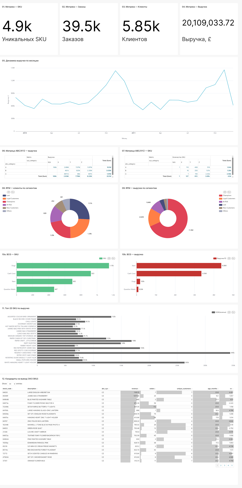

# ABC/XYZ анализ ассортимента интернет-магазина Online Retail II
[](https://github.com/uud-eparh/abc-xyz-retail-analysis/actions/workflows/ci.yml)

Аналитический проект по оптимизации товарного портфеля британского интернет-магазина подарков. Цель — оценить структуру ассортимента и предложить список SKU-кандидатов на сокращение с оценкой рисков.

## 📋 Бизнес-задача

Руководство магазина рассматривает сокращение ассортимента на **~20%**. Задача: оценить риски такого решения и найти SKU-кандидаты, которые действительно можно безопасно вывести из ассортимента.

## 📊 Данные

- **Источник:** [Online Retail II (UCI ML Repository)](https://archive.ics.uci.edu/dataset/502/online+retail+ii)
- **Период:** 01.12.2009 — 09.12.2011 (25 месяцев).
- **Объём:** 1 067 371 транзакция, 5 305 SKU, 5 942 клиента.
- **После очистки:** 1 036 925 строк, 4 895 SKU, 5 852 клиента.

## 🛠️ Технологии

- **PostgreSQL 16** — хранение данных (Docker).
- **Python 3.11** — pandas, numpy, matplotlib, seaborn.
- **Jupyter** — анализ и визуализация.
- **Apache Superset 3.1** — интерактивный дашборд (Docker).

## 🚀 Как запустить

### 1. Клонирование и настройка

```bash
git clone <repo>
cd abc_xyz

# Виртуальное окружение
python -m venv .venv
source .venv/Scripts/activate   # Windows
pip install -r requirements.txt
```

### 2. Запуск инфраструктуры

```bash
docker-compose up -d
# Postgres → порт 6432
# Superset → порт 8088
```

### 3. Загрузка данных

```bash
python scripts/load_data.py
```

### 4. Прогон ноутбуков

Последовательно, каждый с Restart Kernel:

```
notebooks/01_data_exploration.ipynb  → sales
notebooks/02_business_overview.ipynb → метрики + графики
notebooks/03_abc_analysis.ipynb      → abc
notebooks/04_xyz_analysis.ipynb      → xyz
notebooks/05_abc_xyz_matrix.ipynb    → abc_xyz
notebooks/06_strategy.ipynb          → strategies
notebooks/07_candidates.ipynb        → candidates (678)
notebooks/08_impact_estimation.ipynb → candidates_final (443)
notebooks/09_bonus_rfm.ipynb         → rfm
notebooks/10_bonus_bcg.ipynb         → bcg
notebooks/11_bonus_basket.ipynb      → basket_pairs
```

### 5. Дашборд Superset

- URL: http://localhost:8088 (admin / admin)
- Settings → Import Dashboards → выбрать `docker/dashboards.zip`.

## Дашборд Superset



## 📈 Ключевые результаты

### 1. Принцип Парето подтверждается

**21% SKU (1 035 из 4 895) дают 80% выручки.** Классическая структура для ритейла.

### 2. Сезонность ярко выражена

Пики в **ноя-дек** (Рождество), спады в **янв-фев**. Паттерн повторяется год к году — сезонность реальная, не случайность.

### 3. Матрица ABC/XYZ

| Группа | SKU | % SKU | Выручка | % выручки |
|--------|-----|-------|---------|-----------|
| **AX + AY (ядро)** | 518 | 10.6% | £9.95M | **49.5%** |
| **AZ (риск)** | 516 | 10.5% | £5.97M | 29.7% |
| **BZ + CZ (хвост)** | 3 438 | 70.2% | £3.26M | 16.2% |

### 4. RFM-сегментация

**Champions — 22% клиентов, 68% выручки.** `At Risk` — 14% клиентов, но £1.6M выручки. Средний чек Champions — £9 210 (оптовики).

### 5. BCG-матрица

**Stars — 21% SKU, 55% выручки.** Cash Cows — 29% SKU, 42% выручки. Dogs — 36% SKU, только 2.3% выручки.

### 6. Basket analysis

Клиенты часто покупают **наборы вариантов** (разные цвета/размеры одного товара). Lift до **24.94** у пары `84997C + 84997D`. **Кандидаты на вывод не участвуют в топ-корзинах.**

## 💡 Рекомендация

**Предлагаем сократить 443 SKU (9.05% ассортимента).**

- **Их выручка:** £53 558 (**0.27% от общей**).
- **Рычаг:** **34x** (удаляем в 34 раза больше SKU, чем теряем выручки).

### Путь формирования списка

1. **Начало:** CZ (2 426 SKU).
2. **Умеренный фильтр:** 678 SKU.
3. **Исключение сезонных:** 235 SKU.
4. **Финальный список:** **443 SKU**.

### Критерии отбора

- **Возраст** ≥ 12 мес.
- **Клиентская база** ≤ 10.
- **Повторные покупки** = 0.
- **Активные месяцы** ≤ 18.
- **Не сезонные** (пик ноя-дек < 50% выручки).

## ⚠️ Ограничения

- **0.27% выручки — историческая доля.** Реальная потеря может быть меньше (клиенты купят аналоги) или больше (потеря клиентов).
- **Продажи ≠ спрос.** Out-of-stock искажает данные.
- **Нет данных о марже.** Часть SKU могут быть высокомаржинальными.
- **Список 443 SKU — кандидаты**, требуют ручной проверки менеджером.

## 📁 Структура проекта

```
abc_xyz/
├── data/
│   └── online_retail_II.xlsx
├── notebooks/          # 11 ноутбуков по этапам
├── scripts/
│   ├── db_config.py
│   └── load_data.py
├── docker/
│   ├── superset_config.py
│   ├── dashboards.zip  # экспорт дашборда
│   └── docker-compose.yml
├── reports/            # 15+ графиков PNG
├── sql/
├── requirements.txt
├── .env
└── README.md
```

## 🔗 Ссылки

- **Дашборд Superset:** http://localhost:8088
- **Графики:** `reports/*.png`
- **Датасет:** [Online Retail II](https://archive.ics.uci.edu/dataset/502/online+retail+ii)

## 📚 Что можно улучшить

1. **Данные о марже** — пересчитать приоритеты с учётом прибыли.
2. **Basket analysis на всех SKU** — углубить понимание корзины.
3. **Прогнозирование спроса** — добавить ML для сезонности.
4. **Real-time интеграция** — CDC через Debezium, чтобы обновлять данные без перезагрузки.

## 👤 Автор

**Алексей** — [https://github.com/uud-eparh/](#) 
